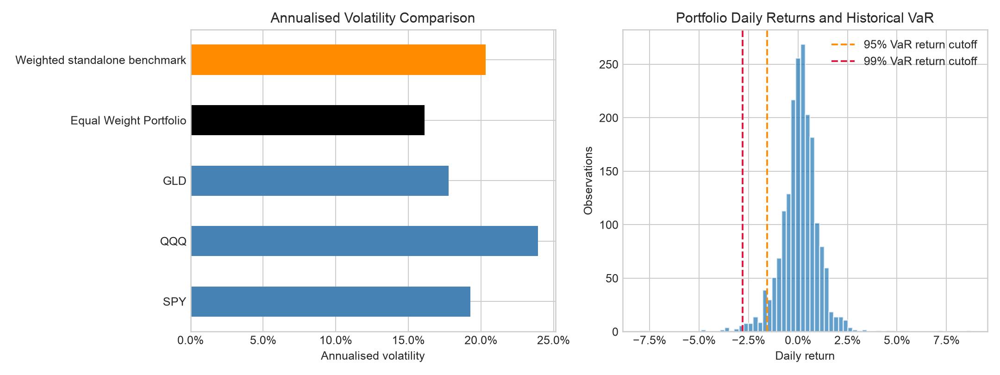

# Cross-Asset Market & Risk Analytics

A Python project comparing asset returns, shared exposures and portfolio risk, with a Fixed Income extension covering Investment Grade and High Yield corporate-bond ETFs. Both notebooks run offline from saved price snapshots.

Start with [Key Findings](KEY_SUMMARY.md) for the overall analysis, or [Fixed Income Findings](FIXED_INCOME_SUMMARY.md) for the bond comparison. The notebooks show the calculations and saved results.

## Analysis

| Module | Instruments and sample | Main question |
|---|---|---|
| [Cross-asset](analysis.ipynb) | SPY, QQQ and GLD; 2019–2026 | How much risk is shared, and what changes in an equal-weight portfolio? |
| [Fixed Income](fixed_income.ipynb) | LQD, HYG and SPY; 2015–2025 | How do return, downside risk and equity co-movement differ? |

The main analysis combines return and risk measures, correlations, QQQ-on-SPY regression and portfolio volatility contributions. Brent futures and GBP/USD are included only as quote-return context, not funded portfolio positions. The three-ETF portfolio rebalances daily to equal weights.

In the main sample, portfolio volatility was 16.11%, compared with a 20.33% perfect-correlation benchmark. QQQ contributed the most volatility despite equal capital weights.



## Fixed Income extension

LQD represents Investment Grade corporate bonds, HYG High Yield corporate bonds, and SPY US equities. Shared functions calculate CAGR, volatility, maximum drawdown and Historical VaR. Correlations and selected stress periods add context: HYG lost more in the COVID sell-off window, while LQD lost more in 2022.

The extension saves a return/risk table, correlation and stress tables, and two figures under `outputs/fixed_income/`. ETF returns combine rate and spread risk; this comparison does not isolate credit risk or assess individual issuers.

## Run locally

Tested with Python 3.14 on macOS. From the project directory:

```bash
python3 -m venv .venv
source .venv/bin/activate
python -m pip install -r requirements.txt
python run_analysis.py
python run_fixed_income_analysis.py
python -m unittest discover -s tests -v
```

Each runner backs up the notebook and its outputs, then executes every cell in a fresh kernel using the active Python environment. Alternatively, open either notebook in VS Code, select that environment's kernel and use Run All. GitHub displays saved notebook outputs; running the analysis requires a local Python environment.

## Methods and conventions

- CAGR uses elapsed calendar years; volatility uses sample daily standard deviation × √252.
- Historical VaR is minus the lower-tail return quantile, with linear interpolation, at 95% and 99% confidence. It is a one-day threshold, not a worst-case loss. Drawdown includes initial capital in the running peak.
- The main analysis assumes a constant 3% annual risk-free rate. Sharpe uses mean daily excess return divided by daily return volatility, annualised by √252. Regression uses excess returns and HAC standard errors with five lags.
- Portfolio volatility is compared with weighted standalone volatility, the perfect-correlation benchmark. This is not another traded portfolio. Volatility contributions are reported in percentage points.
- Missing ETF prices stop the run on the reference calendar; no forward filling is used. Five-asset correlations use complete return rows. Detailed dates, counts and provenance are recorded in [main metadata](outputs/run_metadata.json) and [Fixed Income metadata](data/fixed_income_metadata.json).

## Files

```text
analysis.ipynb / fixed_income.ipynb           Analysis and saved outputs
run_analysis.py / run_fixed_income_analysis.py   Offline execution
KEY_SUMMARY.md / FIXED_INCOME_SUMMARY.md      Findings and interpretation
src/                                         Shared calculation functions
tests/                                       Financial-convention and boundary checks
data/                                        Saved snapshots and provenance
outputs/tables/ and outputs/figures/          Main results
outputs/fixed_income/                        Bond comparison results
requirements.txt                             Tested dependencies
```

CSV values remain numeric decimals; notebook tables format returns and risks as percentages. Supporting tables are retained for reproducibility; start with the summaries rather than reading every output file.

## Limits

The original cross-asset snapshot lacks its download and price-adjustment records, so its results describe the supplied series. The Fixed Income snapshot uses Yahoo adjusted prices as a total-return proxy, not official NAV performance. An entire trading date absent from the vendor data would require an independent exchange-calendar check.

Costs, taxes, futures rolls and FX funding are not modelled. Stress windows are retrospective and differ in length. ETF holdings, duration and credit quality differ; no rate/spread attribution, issuer credit assessment or relative valuation is performed. Historical performance and correlations are descriptive, not forecasts.
